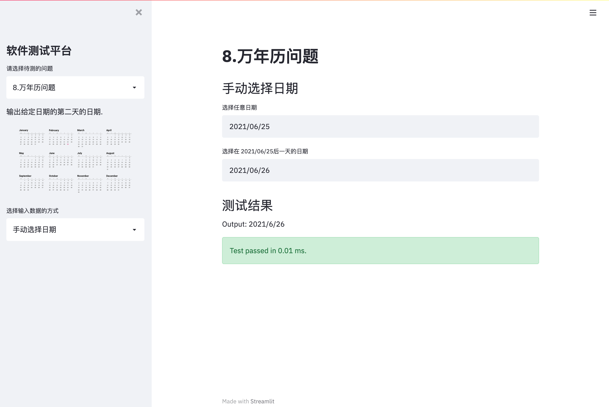

# Software Testing Platform

## 1 项目背景

该项目为同济大学软件学院2021年软件测试的课程项目。该项目设计并实现了一个测试平台，支持测试多种软件测试问题，支持多种测试方法，并给出相关问题的解答方案。

支持的测试问题：

- 三角形类型
- 佣金问题
- 电信收费问题
- 万年历问题
- 销售系统问题

支持的测试方法：

- 上传包含测试用例的`.csv`文件
- 文本框按规则输入测试用例
- 边界值分析法
- 等价类测试法
- 决策表法

用户可以通过该平台对以上问题进行多种方法测试，并用图形展示测试结果。


## 2 项目部署

### 2.1 本地部署

- python版本要求：python 3.9
- python库要求：requirements.txt

下载完整项目后安装依赖：

```
pip install -r requirements.txt
```

在终端输入：


```
streamlit run app.py
```

即可在本地运行该项目

### 2.2 远程部署

1. 使用streamlit自带的远程部署功能

   [Your Streamlit app](https://share.streamlit.io/)

2. 使用阿里云部署

   若阿里云服务器有python环境和streamlit，则操作方法同本地部署一致

   若阿里云服务器不具备上述条件，则：

   1. 创建一个文件夹，创建Dockerfile，内容为

      ```PYTHON
      # 从python3.6镜像基础上创建
      FROM python:3.6
      # 设置镜像源，提高pip install 速度
      RUN pip config set global.index-url https://mirrors.aliyun.com/pypi/simple/ \
              && pip install streamlit
      # streamlit hello创建一个演示页面，映射80端口以便网页访问
      CMD ["streamlit","hello", "--server.port","80"]
      ```

   2. 执行`docker build -t streamlit .`，耐心等待一段时间

   3. 使用streamlit镜像创建容器，运行streamlit

      ```
      docker run -p 80:80 streamlit
      ```

   4. 它会提示你`External URL: http://`，由于80是http的默认端口，所以你在浏览器中直接输入`你的公网IP地址`就可以了

​		

## 3 部分项目截图


|  |  |
| ------------------------------------------------------------ | ------------------------------------------------------------ |

|  |  |
| ------------------------------------------------------------ | ------------------------------------------------------------ |

|  |  |
| ------------------------------------------------------------ | ------------------------------------------------------------ |


|  |  |
| ------------------------------------------------------------ | ------------------------------------------------------------ |

|  |  |
| ------------------------------------------------------------ | ------------------------------------------------------------ |

|  |  |
| ------------------------------------------------------------ | ------------------------------------------------------------ |

更多功能请您移步[Software Testing Platform](http://192.168.31.226:8501/)体验
